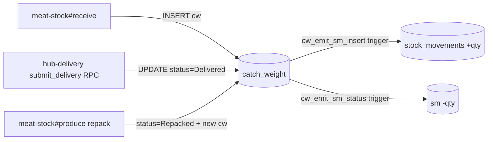
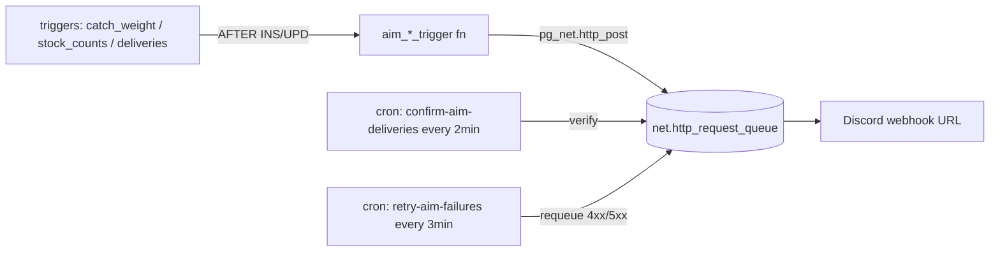

# NNTN Web — Blueprint (current state)

> Living reference for the **existing** website — not future redesign.
> Open this before touching anything: know what writes where, what triggers fire, what bugs lurk.
>
> Last updated: **2026-04-22** · latest commit: `d44c66d` · 47 HTML files

---

## §1 Architecture snapshot

| Layer | Stack |
|---|---|
| Frontend | Vanilla HTML/CSS/JS · no build step · GitHub Pages |
| Auth | Supabase Auth email/password · JWT in `localStorage.nntn_sb_token` · shared `auth.js` |
| Backend | Supabase Postgres (project `emjqulzikpxorvpaaiww`) via PostgREST |
| Schemas active | `public` (core) · `stock` (deliveries) · `cookingbook` (BOM) · `sales_ops` (revenue) |
| Deploy | `git push origin main` → Pages rebuild ~1–2 min |
| CI | `.github/workflows/qa-playwright.yml` runs 17 tests every PR |
| Hub entry | `https://ttt3p.github.io/nntn/hub.html` |
| Repo | `github.com/TTT3P/nntn` |
| Credentials | `~/.zshrc` NNTN_USR/NNTN_PWD · GitHub Secret (same) · `platformci@staffnntn.co` |

**PostgreSQL extensions:** `pg_cron` · `pg_net` · `pgcrypto` · `uuid-ossp` · `pg_graphql` · `supabase_vault` · `pg_stat_statements`

**Cron jobs (6 in `cron.job`):**
| Job | Schedule | Purpose |
|---|---|---|
| `nntn-keep-alive` | `0 8 */5 * *` (every 5 days 08:00) | Prevent Supabase free-tier pause |
| `nntn-platform-auto-reconcile` | `*/5 * * * *` (every 5 min) | Sync sm↔stock_counts drift (creates count event) |
| `nntn-confirm-aim-deliveries` | `*/2 * * * *` | Confirm Discord AIM webhook delivery succeeded |
| `nntn-retry-aim-failures` | `*/3 * * * *` | Retry failed AIM webhooks |
| `nntn-confirm-oos-deliveries` | `*/2 * * * *` | Confirm OOS alert webhooks |
| `nntn-retry-oos-failures` | `*/5 * * * *` | Retry failed OOS alerts |

**Data scale:** 251 active items · 406 catch_weight bags In Stock (A=17, B=72, C=317) · 56 tables with RLS · 73 policies

---

## §2 Page catalog (47 files)

Legend: ✅ stable · ⚠️ has known issue · 🚫 deprecated redirect · 🎨 design preview · 📖 docs

### Public / entry
| URL | LoC | Purpose | Reads | Writes | Status |
|---|---:|---|---|---|---|
| `hub.html` | 206 | Main entry (8 cards) | — | — | ✅ |
| `login.html` | 184 | Auth gate | — | auth only | ✅ |
| `guide.html` | 805 | คู่มือใช้งาน | — | — | ✅ (v2 pending commit) |
| `app.html` | 13 | SPA shell iframe | — | — | ✅ |

### Non-meat stock
| URL | LoC | Purpose | Reads | Writes | Status |
|---|---:|---|---|---|---|
| `index.html` | 411 | Stock status by category | items, v_stock_unified | — | ✅ |
| `dashboard.html` | 567 | 4-card dashboard + filters | items, v_stock_unified, current_stock | — | ✅ |
| `stock-form.html` | 529 | นับสต๊อก (manual count) | items, stock_counts | stock_counts insert | ✅ |
| `count-sheet.html` | 316 | ใบนับ (form variant) | items | stock_counts | ✅ |
| `stock-dispense.html` | 1069 | เบิก + loss | items, v_stock_unified | stock_counts | ✅ |
| `stock-report.html` | 579 | Report + history | items, stock_counts (events) | — | ✅ |
| `portion-form.html` | 401 | แบ่ง SRCP→PKG portions | items, v_stock_unified | portion_log | ✅ |
| `po-receive.html` | 1064 | PO + รับของ | items, suppliers, PO | rpc_receive_universal | ⚠️ *receive_delta bug* |
| `goal-dashboard.html` | 611 | KPI goals | projects, commitments | — | ✅ |
| `data-pipeline.html` | 1501 | ระบบเก็บข้อมูลยอดขาย Grab/FS/Wongnai ingest | — | external sales tables | ✅ (doc light) |
| `production-log-form.html` | 946 | บันทึก prep (no stock effect) | bom_items, recipes | production_log, ingredient_dispense | ✅ |
| `production-log-view.html` | 272 | ประวัติ prep | production_log | — | ✅ |
| `production-history.html` | 322 | ประวัติผลิต (catch-weight-based) | v_production_history, catch_weight | — | ✅ |
| `prep-form.html` | 430 | บันทึก Prep (alt) | bom_items, prep_log | prep_log | ✅ |
| `prep-log-view.html` | 326 | Prep ประวัติ | prep_log | — | ✅ |

### Admin
| URL | LoC | Purpose | Status |
|---|---:|---|---|
| `admin-items.html` | 678 | ทะเบียนวัตถุดิบ (CRUD items + suppliers) | ✅ |
| `admin-bom.html` | 412 | จัดการ BOM | ✅ |
| `admin-config.html` | 422 | Par level config | ✅ |

### Meat stock
| URL | LoC | Purpose | Reads | Writes | Status |
|---|---:|---|---|---|---|
| `meat-stock/index.html` | 2895 | 🔴 **Monolith** — receive/produce/stock/history tabs | catch_weight, cook_sessions, delivery_lines | cw inserts, submit_close_pot RPC | ⚠️ 2900 LoC · split to 4 pages planned |
| `meat-stock/guide.html` | 589 | Meat-stock คู่มือ | — | — | 📖 |

### Cross-domain
| URL | LoC | Purpose | Reads | Writes | Status |
|---|---:|---|---|---|---|
| `hub-delivery.html` | 2477 | 🚚 ใบนำส่ง meat+non-meat | v_stock_unified, catch_weight, delivery_drafts | `submit_delivery` RPC | ⚠️ *draft not auto-cleared after submit* |
| `count-log.html` | 163 | 📋 Transparency log (count/adjust only) | v_count_adjust_log | — | ✅ NEW 22/04 |
| `count-sheet-weekly.html` | 293 | 🖨️ ใบพิมพ์ 7 วัน (12 pre-packaged SKU) | catch_weight, items | — | ✅ NEW 22/04 |
| `platform-health.html` | 262 | 🛡️ SLO / invariants / DLQ | platform_* RPCs | — | ✅ |

### CookingBook (cross-room — CookingBook owns)
| URL | LoC | Purpose | Reads |
|---|---:|---|---|
| `cookingbook/index.html` | 65 | Entry | — |
| `cookingbook/menu.html` | 511 | เมนู + ต้นทุน | — |
| `cookingbook/menu-bom.html` | 154 | Menu BOM + FC% | bom_items, ingredients, recipe_costs, recipes |
| `cookingbook/bom-detail.html` | 185 | BOM detail | bom_items, ingredients, recipe_costs, recipes |
| `cookingbook/ingredients.html` | 133 | Ingredients list | ingredients |
| `cookingbook/prep-rcp.html` | 132 | Prep RCP | bom_items, ingredients, recipes |

### Sales Ops
| URL | LoC | Purpose | Reads |
|---|---:|---|---|
| `sales-ops.html` | 312 | Daily revenue Phase 1 | v_daily_revenue |

### Deprecated / redirect stubs
| URL | Redirects to |
|---|---|
| `receiving-form.html` | `po-receive.html` (3s meta refresh) |
| `daily-form.html` | `index.html` (3s meta refresh) |
| `withdrawal-form.html` | linked from hub-delivery (review needed) |
| `bom-view.html` | replaced by cookingbook/bom-detail |
| `design-mock-production.html` | 🎨 mock |
| `design-system-preview.html` | 🎨 mock |
| `theme-preview.html` | 🎨 mock |
| `rpc-vs-rest.html` | 🎨 demo |
| `cook-approach-compare.html` | 🎨 demo |
| `meat-flow-diagram.html` | 📖 diagram |
| `nntn-supabase-diagram.html` | 📖 diagram |
| `prep-form-preview.html` | 🎨 preview |

---

## §3 Stock write paths

### Meat (catch_weight bag-level)


### Non-meat (stock_counts event log)
```mermaid
flowchart LR
  PO[po-receive] -->|rpc_receive_universal| SC[(stock_counts event=receive)]
  ST[stock-form/count-sheet] -->|INSERT event=count| SC
  DP[stock-dispense] -->|INSERT event=dispense dispense_qty=X| SC
  HD[hub-delivery submit_delivery] -->|INSERT event=dispense| SC
  SC -->|sc_emit_sm_insert trigger| SM[(stock_movements)]
  SC -.check_stock_before_dispense_trg.->|BEFORE insert| GUARD{qty >= dispense_qty?}
  GUARD -->|no| BLOCK[RAISE INSUFFICIENT_STOCK]
```

### PKG (same as non-meat, cascade gap)
- PKG-xxx reads/writes via stock_counts (same path as non-meat)
- **GAP**: PKG-009 "ชุดเครื่องปรุง" = bundle of PKG-001/002/003 — no cascade decrement
- Resolution: CookingBook must define bundle BOM + Platform implements cascade (pending)

### Read path (what UI queries for current qty)
- `v_stock_unified` — `SUM(qty_delta) GROUP BY item_id` from stock_movements
- Single source of truth since 21/04 migration

---

## §4 Triggers & RPCs reference

### RPCs (public schema)
| Name | Purpose | Caller |
|---|---|---|
| `rpc_receive_universal` | Universal receive (routes by item.type) | po-receive |
| `rpc_count_adjust` | Explicit count adjustment | (legacy admin) |
| `rpc_delivery_out` | Delivery out path (legacy) | — |
| `rpc_delivery_reverse` | Undo a delivery (compensating event) | admin tools |
| `rpc_disposal` | Mark bag disposed | meat-stock |
| `rpc_po_receive` | Older PO receive (deprecated by universal) | — |
| `rpc_production_execute` | Execute production (catch_weight multi-step) | meat-stock#produce |
| `rpc_repack_execute` | Execute repack session | meat-stock#produce |
| `rpc_stock_by_sku` | Lookup stock per SKU | helpers |
| `rpc_stock_snapshot*` | Snapshot for reports | platform-health |
| `rpc_tag_production` | Tag CW rows with production ref | meat-stock |
| `rpc_warehouse_transfer` | Move bag between คลัง A/B/C | meat-stock |

### RPC (stock schema)
| Name | Purpose |
|---|---|
| `stock.submit_delivery` | Atomic meat+nm delivery (bags→Delivered + stock_counts dispense + deliveries row) |

### Triggers — critical safety
| Table | Trigger | When | What |
|---|---|---|---|
| `stock_movements` | `sm_block_mutation` | BEFORE UPDATE/DELETE | ⚠️ **Raises** — sm is append-only |
| `stock_movements` | `sm_auto_emit_activity` | AFTER INSERT | Emits activity stream |
| `catch_weight` | `stamp_actor_catch_weight` | BEFORE INS/UPD | Sets `actor_id` from `app.actor` GUC |
| `catch_weight` | `prevent_deliver_if_not_in_stock` | BEFORE UPDATE | Blocks status→Delivered if not In Stock |
| `catch_weight` | `cw_emit_sm_insert` | AFTER INSERT | Emits sm +qty_delta |
| `catch_weight` | `cw_emit_sm_status` | AFTER UPD(status) | Emits sm (Delivered=-, Disposed=-) |
| `catch_weight` | `cw_emit_sm_transfer` | AFTER UPD(warehouse) | Emits warehouse_transfer event |
| `catch_weight` | `cw_oos_alert_trigger` | AFTER INS/UPD(status) | Discord OOS alert |
| `catch_weight` | `aim_catch_weight_trg` | AFTER INS/UPD | Discord AIM notification |
| `stock_counts` | `check_stock_before_dispense_trg` | BEFORE INSERT | ⚠️ **Guard**: raises INSUFFICIENT_STOCK |
| `stock_counts` | `sc_emit_sm_insert` | AFTER INSERT | Emits sm by event_type (receive/dispense/count/adjustment) |
| `stock_counts` | `aim_stock_counts_trg` | AFTER INSERT | Discord AIM |
| `deliveries` | `aim_deliveries_trg` | AFTER INSERT | Discord AIM |

### Views
- `v_stock_unified` — **SoT** qty_on_hand per item (frontend primary)
- `v_count_adjust_log` — for count-log.html (count_adjust_up/down only)
- `v_production_history` — cw join production tags
- `v_production_reconciliation` — recipe vs actual consumed
- `v_stock_history_per_item` · `v_stock_history_per_lot` — audit timelines
- `v_cost_per_bag` — cost tracking

---

## §5 Known bugs + workaround

| ID | Severity | Bug | Workaround | Fix path |
|---|---|---|---|---|
| **B1** | 🔴 P1 | `rpc_receive_universal` + `emit_sm_from_stock_counts` receive branch uses `NEW.qty` (= after total) as delta → inflates sm when before>0 | Zero-out SKU before first receive (rare ops): `INSERT stock_counts qty=0 event=count` | Fix trigger: compute `v_delta = NEW.qty - running_total` OR rpc writes delta not after-total |
| **B2** | 🟠 P1 | `hub-delivery` draft not deleted after successful submit → stale drafts block re-submit | Manual `DELETE FROM stock.delivery_drafts WHERE bill_no=X` | Add `DELETE` at end of `submit_delivery` success in hub-delivery.html submitDelivery() |
| **B3** | 🟡 P2 | Bundle SKU (e.g. PKG-009 ชุดเครื่องปรุง) dispenses standalone qty without cascading sub-items | None | Waiting on CookingBook BOM spec → Platform implements cascade |
| **B4** | 🟡 P2 | `platform_slo_log` SLO cron not writing | None needed (no downstream reader) | Drop table OR schedule cron |
| **B5** | 🟢 P3 | count-log doesn't show receive/dispense events → user may see +10 adjust + think stock is 10 | Check dashboard for true qty | Add qty_on_hand column to count-log UI |
| **B6** | 🟢 P3 | 4-bill scatter when shipping combined meat+nm via SQL (FS20260422-1 + -NM + -M2 + -NM2) | bill_no UNIQUE prevents merge | UI enhancement: group bills by date+branch in hub-delivery history view |
| **B7** | 🟢 P3 | `data-pipeline.html` purpose unclear (1501 LoC) | Skip | Audit + deprecate or document |

---

## §6 Decision log (rolling, latest 30)

| Date | Decision | Why |
|---|---|---|
| 22/04 | `d44c66d` draft nm rows show stock badge (✓/⚠️/❌) | Draft flow — see stock mismatch before submit day |
| 22/04 | `f0147c8` po-receive allow PKG items | PKG can legit come from supplier |
| 22/04 | `370e289` count-sheet-weekly narrow whitelist to 12 SKU (v2 PDF) | Per ไทน์ reference — shop-counter pre-packaged only |
| 22/04 | `185d3e4` count-log.html + v_count_adjust_log view | Transparency > RLS lockdown (small-team deterrent) |
| 22/04 | `f078b48` remove หม้อตุ๋น dup card + redirect 2 orphan forms | Hub cleanup |
| 22/04 | `dee8ec0` harmonize 3 cwStock loads (sku+category) | Row 2 dropdown empty bug in meat-stock#produce |
| 22/04 | `98b4a57` parse RPC errors → Thai friendly | User can't read `HTTP 400` |
| 22/04 | `f5869f5` pre-submit re-fetch v_stock_unified (stale cache guard) | Another session may dispense |
| 22/04 | `0bae822` block OOS items in hub-delivery nm picker | PKG stock cache bug + DB-level guard bypass risk |
| 22/04 | `d509bd0` wrap bag id with String().substring() | bigint crash when legacy_cw_row null |
| 22/04 | `1c03ef8` migrate 3 pages to v_stock_unified (SoT migration) | Deprecate raw stock_counts reads |
| 22/04 | Zero-out ผักบุ้ง SP-128 | Receive_delta bug workaround (B1) |
| 22/04 | Revert 13-bag MT-019 repack | น้องทำผิด (source #3283/#3284 back + output #3302-3314 Out) |
| 22/04 | Delete stuck draft NT20260422-1 | Auto-clear bug B2 |
| 21/04 | `ae24aa0` sales-ops Section 1 MVP live | Unblock ไทน์ 4-day wait |
| 21/04 | `b647726` frontend SoT migration (stock-dispense, po-receive via RPC) | Unify read path |
| 21/04 | `6e9f54a` platform-health audit tab + JWT actor + unified receive | Audit + observability |
| 21/04 | `fe1416f` platform-health operational dashboard (Sprint 1) | Stop-the-bleeding visibility |
| 21/04 | `951f8a2` hub-delivery draft as source of truth on submit | Draft-form desync fix |
| 21/04 | `ea25058` auth.js JWT auto-refresh + 401 retry | Token expiry UX |
| 21/04 | `a471f97` meat-stock uniform-weight fill for fixed portions | UX |
| 21/04 | `ffeebb4` multi-SKU output groups + cleanup MT-031 | แปรรูป UX |
| 20/04 | `b49a802` goal-dashboard v2 live data | Replace mock |
| 19/04 | `422c53a` shared shell v2 iframe-based SPA | Unified navigation |
| 19/04 | `e064282` shared shell sidebar/topbar on 10 pages | IA consistency |
| 19/04 | `2253120` nav: Non-meat Stock + split Hub/Goal | Clarify IA |
| 19/04 | `8ca5a0e` revert expandable nav — flat | Sub-categories need aggregate pages |
| 19/04 | `0f2165a` expandable nested nav (since reverted) | Shopify-style tree |
| 19/04 | `e98b8e3` fix nav-badge query (current_status → current_stock) | Badge showed wrong count |
| 18/04+ | Auto-reconcile cron · platform_health SLOs · pg_net DLQ | Operational reliability sprint |

---

## §7 Quick lookup

### "Where does qty come from in UI?"
→ `v_stock_unified` (since 21/04) · query: `SELECT qty_on_hand FROM v_stock_unified WHERE sku='SKU'`

### "Where do I add a new item?"
→ `admin-items.html` — inserts into `public.items`

### "How do I dispense without triggering guard?"
→ Can't — guard fires BEFORE insert. Must ensure `SUM(sm.qty_delta) >= dispense_qty` first

### "How do I undo a delivery?"
→ `SELECT public.rpc_delivery_reverse(delivery_id)` — creates compensating events

### "Where are Discord notifications configured?"
→ `aim_*_trg` triggers on catch_weight / stock_counts / deliveries · webhook in pg_net queue

### "Where is JWT handled?"
→ `auth.js` (shared) — auto-refresh on 401 · stored in `localStorage.nntn_sb_token`

### "How do I add a new module to hub?"
→ Edit `hub.html` grid section (8 cards currently) + create HTML file

---

---

## §8 CI / Ops / Backup

### GitHub Actions (`.github/workflows/`)
| Workflow | Trigger | Purpose |
|---|---|---|
| `qa-playwright.yml` | PR + push main | 17-test regression suite (needs NNTN_USR/PWD secrets) |
| `backup.yml` | Nightly cron | Calls `scripts/backup.py` — dumps key tables to JSON |
| `keepalive.yml` | Periodic | Cron-poke Supabase endpoints (duplicate of DB cron safety) |
| `security-probe.yml` | `0 2 * * 1` (Mon 09:00 BKK) | Probe anon access — all critical endpoints must return 401 |

### Scripts (`scripts/`)
| File | Purpose |
|---|---|
| `backup.py` | Export items · catch_weight · stock_movements · etc → `~/Documents/NNTN-Backup/YYYY-MM-DD/*.json` |
| `gen_arch.py` | Scan HTML → generate `NNTN-Vault/System/architecture/module-catalog.md` (⚠️ TCC-blocked on macOS currently) |

### Testing (Playwright)
Config: `playwright.config.ts` · suites in `tests/`:
- `auth.setup.js` — login once, store state
- `public-pages.spec.js` — login + hub render
- `hub-delivery.spec.js` — form loads + history
- `hub-delivery-draft.spec.js` — draft roundtrip
- `meat-stock.spec.js` — FIFO + repack + dropdowns
- `qa-goal-dashboard.spec.js` — structure integrity
- `end-to-end-smoke.spec.js` — smoke top flows

**Run:** `npm test` · `npm run test:ui` · `npm run test:headed` (dev: inherit env from `~/.zshrc`)

### GitHub Secrets (repo `TTT3P/nntn`)
- `NNTN_USR` · `NNTN_PWD` — Playwright login
- `SUPABASE_ANON_KEY` — security-probe workflow
- (Backup script uses local config, not repo secret)

### RLS Policy summary
- 56 tables RLS-enabled · 73 policies total
- Pattern: `authenticated_all = true` on most tables (transparent-team model)
- Sensitive: `stock_movements` = append-only via `sm_block_mutation` trigger (not RLS)
- Auth enforced at frontend level via `auth.js` JWT check

---

## §9 Integrations (external)

### Discord AIM (outgoing webhook via pg_net)

- Config table: `aim_config`
- Functions: `aim_notify`, `aim_catch_weight_trigger`, `aim_stock_counts_trigger`, `aim_deliveries_trigger`, `aim_items_trigger`, `aim_process_summary_trigger`
- Channels: `#aim` (stock events), `#coo`, `#platform`, `#stock`, `#cookingbook`, `#sales-ops`

### Sales data ingestion (`data-pipeline.html`)
- Sources: **Grab · FoodStory · Wongnai** — manual/scraped dump into SB tables
- Consumed by: `sales-ops.html` (v_daily_revenue)
- Scope: Platform holds schema; CookingBook/Sales Ops interpret

### Keepalive (dual layer)
1. GitHub Action `keepalive.yml`
2. Supabase `cron.job` `nntn-keep-alive` every 5 days
(belt + suspenders to prevent free-tier pause)

### Webhook DLQ (pg_net)
- `net.http_request_queue` holds pending webhooks
- Failure retries via cron
- Monitored on `platform-health.html` (DLQ stuck > 15 min alarm)

---

## §10 Conventions / glossary

### SKU prefix
| Prefix | Meaning | Example | Count |
|---|---|---|---|
| `MT-xxx` | Meat — finished portioned pack | `MT-019 เนื้อสดหมักนุ่ม` | ~40 |
| `SP-xxx` | Supply / supplies (any non-meat single-item) | `SP-128 ผักบุ้งสด` | ~100 |
| `SRCP-xxx` | Semi-recipe / prep (made in-house, raw→cooked intermediate) | `SRCP-004 พริกน้ำส้ม` | 5 |
| `PKG-xxx` | Packaged ready-to-sell (bottle/bag) | `PKG-006 น้ำเก็กฮวย 220ml` | 16 |
| `MISC` | Ad-hoc free-text item (not in catalog) | — | 1 |

### Item category (14 active)
| Category | Count | Notes |
|---|---:|---|
| `seasoning` | 59 | Sauce, condiments |
| `consumable` | 29 | Packaging supplies (SP- items) |
| `packaging` | 29 | Wrappers, boxes |
| `spice` | 26 | Dry spices |
| `vegetable` | 26 | ผัก — received fresh, dispensed same-day typically |
| `meat` | 19 | Raw meat cuts |
| `pkg` | 16 | Pre-packaged SKU |
| `meat_portioned` | 12 | Portioned meat (75g, 100g, 500g pre-pack) |
| `noodle` | 11 | เส้น brands |
| `meat_cooked` | 10 | Cooked meat (ตุ๋น ready) |
| `srcp` | 5 | In-house prep (sauce, dressing) |
| `meat_trim` | 5 | เศษเนื้อ |
| `meat_other` | 3 | Offal / special parts |
| `misc` | 1 | Catch-all |

### Warehouse (คลัง) convention
- **คลัง A** (17 bags) = incoming raw staging — ใช้แทน "เพิ่งรับมา ยังไม่ผ่าน process"
- **คลัง B** (72 bags) = cooking area / repack staging — อยู่ระหว่าง process
- **คลัง C** (317 bags) = ready-to-deliver — ปกติคลัง C ใหญ่สุด, ส่งจากตรงนี้ไปหน้าร้าน

### catch_weight status transitions
```
✅ In Stock ────┬──→ 🔄 Repacked (source consumed in repack)
                ├──→ 🚚 Delivered (shipped via submit_delivery)
                ├──→ 🗑️ Disposed (loss/expired)
                └──→ ❌ Out (cancelled, manual admin)
```
- Blocked by `prevent_deliver_if_not_in_stock` trigger (can't Deliver if not In Stock)
- Blocked by `sm_block_mutation` (can't UPDATE sm row — bags can transition, sm append-only)

### Actor resolution chain
1. `rpc_receive_universal` / `submit_delivery` → sets `SET app.actor = p_actor` via `set_config`
2. `stamp_actor_catch_weight` BEFORE INS/UPD trigger → reads GUC → writes `cw.actor_id`
3. `_resolve_actor()` fallback → returns `current_setting('app.actor', true)` or auth.jwt()->>'email'
4. UI: `window.nntnCurrentUser` (from auth.js) passed as p_actor param

### Auth refresh cycle (`auth.js`)
- On load: check localStorage `nntn_sb_token`
- Expired / near-expiry: auto-refresh via Supabase Auth endpoint
- On 401 response: retry once with fresh token (since `ea25058` 21/04)
- Not-logged-in: redirect to `login.html`

---

## §11 What this blueprint does NOT cover (future work)

- ❌ CookingBook BOM detail schema — owned by CookingBook room
- ❌ Sales data pipeline internals (Grab/FS scraping logic)
- ❌ Web redesign target state (separate Phase 1 deliverable)
- ❌ Mobile/responsive behavior (desktop-first only)
- ❌ Full RLS policy audit per-table (73 policies — sampling only)
- ❌ DB migration history (list in Supabase dashboard `supabase_migrations.schema_migrations`)

---

**Maintenance:** update §6 decision log per commit (1-line) · refresh §2 page catalog monthly or when adding/removing pages · bump "Last updated" at top.
