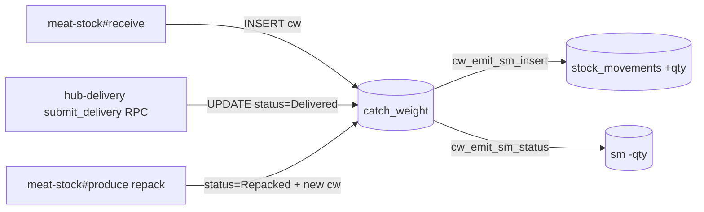
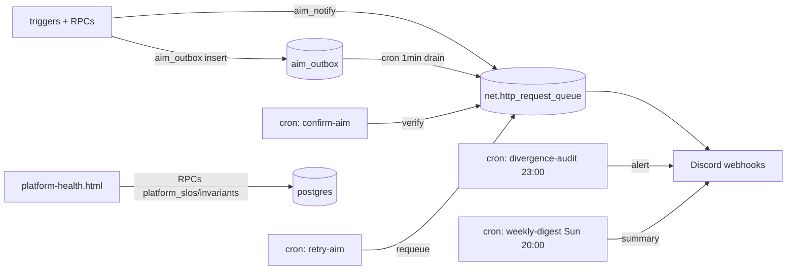

# NNTN Web — Blueprint (current state)

> Living reference for the **existing** website — not future redesign.
> Open this before touching anything: know what writes where, what triggers fire, what bugs lurk.
>
> Last updated: **2026-04-28** · 51 HTML files · refactored from v1 (752→ ~470 lines · runbooks split out)

---

## §0 Source of Truth · Effective 27/04/2026

**Supabase project `emjqulzikpxorvpaaiww` = SINGLE SOURCE OF TRUTH** สำหรับทุกข้อมูล operational ของระบบ NNTN.

- Master Excel (`ระบบสต๊อกเนื้อตุ๋น NNTN_APR2026.xlsx`) = **read-only mirror** · export จาก Supabase · ห้าม edit ตรง
- Data change → migration / web app / SQL · ห้าม dual-write
- Conflict → trust Supabase · update Excel ตาม
- Team read-only → Supabase MCP `--read-only` (per CLAUDE.md RULE 1)

Supersedes prior dual-maintain policy (Excel + Supabase parallel · obsolete 27/04/2026).

---

## §1 Architecture snapshot

| Layer | Stack |
|---|---|
| Frontend | Vanilla HTML/CSS/JS · no build step · GitHub Pages |
| Auth | Supabase Auth email/password · JWT in `localStorage.nntn_sb_token` · shared `auth.js` |
| Backend | Supabase Postgres (project `emjqulzikpxorvpaaiww`) via PostgREST |
| Schemas active | `public` (core) · `stock` (deliveries) · `cookingbook` (BOM) · `sales_ops` (revenue) · `cron` · `net` (pg_net DLQ) · `auth` (Supabase) |
| Deploy | `git push origin main` → Pages rebuild ~1–2 min |
| CI | `.github/workflows/qa-playwright.yml` runs 17 tests every PR |
| Hub entry | `https://ttt3p.github.io/nntn/hub.html` |
| Repo | `github.com/TTT3P/nntn` |
| Credentials | `~/.zshrc` `NNTN_USR`/`NNTN_PWD` · GitHub Secret (same) · `platformci@staffnntn.co` |

**PostgreSQL extensions:** `pg_cron` · `pg_net` · `pgcrypto` · `uuid-ossp` · `pg_graphql` · `supabase_vault` · `pg_stat_statements`

**Cron jobs (9 in `cron.job`):**
| Job | Schedule | Purpose |
|---|---|---|
| `nntn-keep-alive` | `0 8 */5 * *` | Prevent Supabase free-tier pause |
| `nntn-platform-auto-reconcile` | `*/5 * * * *` | Sync sm↔stock_counts drift (creates count event) |
| `nntn-confirm-aim-deliveries` | `*/2 * * * *` | Confirm Discord AIM webhook delivery succeeded |
| `nntn-retry-aim-failures` | `*/3 * * * *` | Retry failed AIM webhooks |
| `nntn-confirm-oos-deliveries` | `*/2 * * * *` | Confirm OOS alert webhooks |
| `nntn-retry-oos-failures` | `*/5 * * * *` | Retry failed OOS alerts |
| `nntn-divergence-audit` | `0 16 * * *` (23:00 BKK) | Phase A · sm vs CW divergence report |
| `nntn-weekly-digest` | `0 13 * * 0` (Sun 20:00 BKK) | Phase C · weekly volume + active users + drift |
| `nntn-aim-outbox-drain` | `* * * * *` | Phase 2 · group non-meat events into 1 digest msg |

**Live snapshot queries** (don't inline numbers — they drift):
- Active items: `SELECT count(*) FROM items WHERE is_active`
- Bags by warehouse: `SELECT warehouse, count(*) FROM catch_weight WHERE status='✅ In Stock' GROUP BY warehouse`
- RLS policies: `SELECT count(*) FROM pg_policies`
- Tables with RLS: `SELECT count(*) FROM pg_class WHERE relrowsecurity`

---

## §2 Page catalog (51 files)

Legend: ✅ stable · ⚠️ has known issue · 🚫 deprecated redirect · 🎨 design preview · 📖 docs

### Public / entry
| URL | LoC | Purpose | Reads | Writes | Status |
|---|---:|---|---|---|---|
| `hub.html` | 206 | Main entry (8 cards) | — | — | ✅ |
| `login.html` | 184 | Auth gate | — | auth only | ✅ |
| `guide.html` | 805 | คู่มือใช้งาน · v2 sticky FAB + flow diagrams | — | — | ✅ |
| `app.html` | 13 | SPA shell iframe | — | — | ✅ |

### Non-meat stock
| URL | LoC | Purpose | Reads | Writes | Status |
|---|---:|---|---|---|---|
| `index.html` | 411 | Stock status by category | items, v_stock_unified | — | ✅ |
| `dashboard.html` | 567 | 4-card dashboard + filters | items, v_stock_unified, current_stock | — | ✅ |
| `stock-form.html` | 529 | นับสต๊อก (manual count) | items, stock_counts | stock_counts insert | ✅ |
| `count-sheet.html` | 316 | ใบนับ (form variant) | items | stock_counts | ✅ |
| `stock-dispense.html` | 1069 | เบิก + loss | items, v_stock_unified | stock_counts | ✅ |
| `stock-report.html` | 579 | Report + history | items, stock_counts (events) | — | ✅ |
| `portion-form.html` | 401 | แบ่ง SRCP→PKG portions | items, v_stock_unified | portion_log | ✅ |
| `po-receive.html` | 1064 | PO + รับของ | items, suppliers, PO | rpc_receive_universal | ✅ B1 closed 28/04 |
| `goal-dashboard.html` | 611 | KPI goals | projects, commitments | — | ✅ |
| `data-pipeline.html` | 1501 | ระบบเก็บข้อมูลยอดขาย Grab/FS/Wongnai ingest | — | external sales tables | ⚠️ B7 purpose audit |
| `production-log-form.html` | 946 | บันทึก prep (no stock effect) | bom_items, recipes | production_log, ingredient_dispense | ✅ |
| `production-log-view.html` | 272 | ประวัติ prep | production_log | — | ✅ |
| `production-history.html` | 322 | ประวัติผลิต (catch-weight-based) | v_production_history, catch_weight | — | ✅ |
| `prep-form.html` | 430 | บันทึก Prep (alt) | bom_items, prep_log | prep_log | ✅ |
| `prep-log-view.html` | 326 | Prep ประวัติ | prep_log | — | ✅ |

### Admin
| URL | LoC | Purpose | Status |
|---|---:|---|---|
| `admin-items.html` | 678 | ทะเบียนวัตถุดิบ (CRUD items + suppliers) | ✅ |
| `admin-bom.html` | 412 | จัดการ BOM | ✅ |
| `admin-config.html` | 422 | Par level config | ✅ |

### Meat stock
| URL | LoC | Purpose | Reads | Writes | Status |
|---|---:|---|---|---|---|
| `meat-stock/index.html` | 2895 | 🔴 **Monolith** — receive/produce/stock/history tabs | catch_weight, cook_sessions, delivery_lines | cw inserts, submit_close_pot RPC | ⚠️ 2900 LoC · split planned |
| `meat-stock/guide.html` | 589 | Meat-stock คู่มือ | — | — | 📖 |

### Cross-domain
| URL | LoC | Purpose | Reads | Writes | Status |
|---|---:|---|---|---|---|
| `hub-delivery.html` | 2477 | 🚚 ใบนำส่ง meat+non-meat | v_stock_unified, catch_weight, delivery_drafts | `submit_delivery` RPC | ✅ B2 closed 28/04 |
| `count-log.html` | 163 | 📋 Transparency log (count/adjust only) | v_count_adjust_log | — | ✅ |
| `count-sheet-weekly.html` | 293 | 🖨️ ใบพิมพ์ 7 วัน (12 pre-packaged SKU) | catch_weight, items | — | ✅ |
| `platform-health.html` | 262 | 🛡️ SLO / invariants / DLQ | platform_* RPCs | — | ✅ |

### CookingBook (cross-room — CookingBook owns)
| URL | LoC | Purpose | Reads |
|---|---:|---|---|
| `cookingbook/index.html` | 98 | Entry · 2 sections (BOM · SOP) · role-gated | — |
| `cookingbook/menu.html` | 511 | เมนู + ต้นทุน | — |
| `cookingbook/menu-bom.html` | 154 | Menu BOM + FC% | bom_items, ingredients, recipe_costs, recipes |
| `cookingbook/bom-detail.html` | 185 | BOM detail | bom_items, ingredients, recipe_costs, recipes |
| `cookingbook/ingredients.html` | 133 | Ingredients list | ingredients |
| `cookingbook/prep-rcp.html` | 132 | Prep RCP | bom_items, ingredients, recipes |
| `admin-sop.html` | 521 | SOP authoring · 7-state workflow | recipes · bom_items · cookingbook.sop_steps · storage `sop-covers` |
| `sop-review.html` | 433 | ไทน์ QC queue | cookingbook.sop_steps |
| `print-recipe.html` | 409 | A4 print | recipes · bom_items · cookingbook.sop_steps |

### Sales Ops
| URL | LoC | Purpose | Reads |
|---|---:|---|---|
| `sales-ops.html` | 1286 | Daily revenue · 6-breakpoint responsive · sparklines · donut · stacked bar | v_daily_revenue · v_menu_performance · v_revenue_by_channel |

### Deprecated / redirect / mock
| URL | Note |
|---|---|
| `receiving-form.html` | redirect → `po-receive.html` |
| `daily-form.html` | redirect → `index.html` |
| `withdrawal-form.html` | linked from hub-delivery (review needed) |
| `bom-view.html` | replaced by cookingbook/bom-detail |
| `salesops-daily-dashboard-poc.html` · `design-mock-production.html` · `design-system-preview.html` · `theme-preview.html` · `rpc-vs-rest.html` · `cook-approach-compare.html` · `prep-form-preview.html` | 🎨 mocks |
| `meat-flow-diagram.html` · `nntn-supabase-diagram.html` | 📖 diagrams |

---

## §3 Stock write paths

### Meat (catch_weight bag-level)


### Non-meat (stock_counts event log)
```mermaid
flowchart LR
  PO[po-receive] -->|rpc_receive_universal| SC[(stock_counts event=receive)]
  ST[stock-form/count-sheet] -->|INSERT event=count| SC
  DP[stock-dispense] -->|INSERT event=dispense dispense_qty=X| SC
  HD[hub-delivery submit_delivery] -->|INSERT event=dispense| SC
  SC -->|sc_emit_sm_insert| SM[(stock_movements)]
  SC -.check_stock_before_dispense_trg.->|BEFORE insert| GUARD{qty >= dispense_qty?}
  GUARD -->|no| BLOCK[RAISE INSUFFICIENT_STOCK]
```

### Read path (UI → live qty)
- `v_stock_unified` — `SUM(qty_delta) GROUP BY item_id` from stock_movements (SoT since 21/04)

### PKG (same as non-meat)
- PKG-xxx reads/writes via stock_counts (same path as non-meat)
- See B3 — bundle SKU cascade gap (PKG-009)

---

## §4 Triggers & Views reference

### Triggers — critical safety
| Table | Trigger | When | What |
|---|---|---|---|
| `stock_movements` | `sm_block_mutation` | BEFORE UPDATE/DELETE | ⚠️ **Raises** — sm is append-only |
| `stock_movements` | `sm_auto_emit_activity` | AFTER INSERT | Emits activity stream |
| `catch_weight` | `stamp_actor_catch_weight` | BEFORE INS/UPD | Sets `actor_id` from `app.actor` GUC |
| `catch_weight` | `prevent_deliver_if_not_in_stock` | BEFORE UPDATE | Blocks status→Delivered if not In Stock |
| `catch_weight` | `cw_emit_sm_insert` | AFTER INSERT | Emits sm +qty_delta |
| `catch_weight` | `cw_emit_sm_status` | AFTER UPD(status) | Emits sm (Delivered=-, Disposed=-) |
| `catch_weight` | `cw_emit_sm_transfer` | AFTER UPD(warehouse) | Emits warehouse_transfer event |
| `catch_weight` | `cw_oos_alert_trigger` | AFTER INS/UPD(status) | Discord OOS alert |
| `catch_weight` | `aim_catch_weight_insert_trg` | AFTER INSERT (per-row) | Discord AIM (receive) |
| `catch_weight` | `aim_catch_weight_process_summary_trg` | AFTER INSERT (statement) | Discord summary on multi-row INSERT |
| `catch_weight` | `aim_catch_weight_status_summary_trg` | AFTER UPDATE (statement) | Phase 1 · status change aggregate |
| `stock_counts` | `check_stock_before_dispense_trg` | BEFORE INSERT | ⚠️ **Guard**: raises INSUFFICIENT_STOCK |
| `stock_counts` | `sc_emit_sm_insert` | AFTER INSERT | Emits sm by event_type (receive/dispense/count) |
| `stock_counts` | `aim_stock_counts_trg` | AFTER INSERT | Phase 2 · writes `aim_outbox` row (since 27/04) |
| `deliveries` | `aim_deliveries_trg` | AFTER INSERT | Discord AIM |

### Views
- **`v_stock_unified`** — qty_on_hand per item · frontend SoT
- `v_count_adjust_log` — count-log.html (count_adjust_up/down only)
- `v_production_history` — cw join production tags
- `v_production_reconciliation` — recipe vs actual consumed
- `v_stock_history_per_item` · `v_stock_history_per_lot` — audit timelines
- `v_cost_per_bag` — cost tracking
- `v_user_actions_daily` — Phase A unified action log
- `v_sm_cw_divergence` — Phase A sm vs CW mismatch detector

### Outbox / DLQ tables
- **`aim_outbox`** — buffer for non-meat Discord events (Phase 2 · drained by `nntn-aim-outbox-drain` cron). Schema: `id · created_at · event_type · actor · source · item_* · qty · balance_after · sent_at`
- `aim_notify_dlq` — failed webhook retries
- `net.http_request_queue` — pg_net outgoing queue

---

## §5 Known bugs + workaround

| ID | Severity | Bug | Workaround | Fix path |
|---|---|---|---|---|
| ~~B1~~ | ✅ closed 28/04 | sm-delta inflate via `emit_sm_from_stock_counts` | — | Fixed by migration `b1_fix_emit_sm_receive_delta_20260423` (apply 23/04) · `v_sm_cw_divergence` non-meat clean (28/04 verify) |
| ~~B2~~ | ✅ closed 28/04 | hub-delivery draft stale after submit | — | Fixed at `hub-delivery.html:2446` — DELETE `delivery_drafts?id=eq.${_pendingDraftId}` หลัง submit success (try/catch + null guard) |
| **B3** | 🟡 P2 | Bundle SKU (e.g. PKG-009 ชุดเครื่องปรุง) dispenses standalone qty without cascading sub-items | None | Waiting on CookingBook BOM spec → Platform implements cascade |
| **B5** | 🟢 P3 | count-log doesn't show receive/dispense events | Check dashboard for true qty | Add qty_on_hand column to count-log UI |
| **B6** | 🟢 P3 | 4-bill scatter when shipping combined meat+nm via SQL | bill_no UNIQUE prevents merge | UI: group bills by date+branch in hub-delivery history |
| **B7** | 🟢 P3 | `data-pipeline.html` purpose unclear (1501 LoC) | Skip | Audit + deprecate or document |
| **B8** | 🟡 P2 | `catch_weight.weight_g` PATCH ไม่ emit sm (trigger fires on status change only) → "ปรับน้ำหนัก" ใน ปรับยอด modal เปลี่ยน weight ใน DB แต่ stock balance display ที่ sum sm ยังเท่าเดิม | UX: น้องเห็นน้ำหนักเปลี่ยนใน list ทันที (frontend reads from cw direct) แต่ sm-based dashboards drift | Add trigger `cw_emit_sm_weight_adjust` AFTER UPDATE OF weight_g · emit count_adjust delta |

> Removed B4 (`platform_slo_log` cron) — superseded by §8 SLO + observability cleanup. If reinstated, file new bug.

---

## §6 ADRs (architecturally significant decisions)

> Only entries that override defaults or have permanent reasoning. Routine commits → `ship-log.md`.

| Date | Decision | Why (load-bearing rationale) |
|---|---|---|
| 28/04 | **ปรับยอด modal rewired to `rpc_disposal`** for "ตัดออกจากสต๊อก" path (was calling non-existent `stock_adjustments` table → PGRST205) | The `stock_adjustments` table never existed in production. RPC `rpc_disposal` is the canonical disposal path · emits compensating sm + sets cw status correctly. Audit trail through sm + cw status history (no separate adjustments table needed). |
| 27/04 | **Client-side unit guard** in `auth.js` (`nntnIsDecimalUnit` + `nntnEnforceIntegerUnit`) · all qty inputs use `step="1"` for integer units, reject decimal at submit | Operational units (ถุง/แผง/ชุด/ขวด/แพ็ก) are inherently integer · DB has no constraint to enforce. Client-side guard prevents bad data at source. Decimal allowed only for weight/volume (`กก./กรัม/ml/ลิตร/cc/oz`). |
| 27/04 | **Phase 2 outbox digest** for non-meat (`aim_outbox` + `aim_outbox_drain` + 1-min cron) | Trigger-level statement aggregation can't span multiple RPC calls. Outbox + cron is the only pattern that groups 12 separate RPC submits into 1 digest msg. Worst-case 90s latency accepted. |
| 25/04 | **Phase 1 statement-level UPDATE trigger** for catch_weight (`aim_cw_status_summary_v3`) | Use Postgres `REFERENCING OLD/NEW TABLE` to aggregate `submit_delivery` multi-row UPDATE into 1 msg per (item, old→new). Per-row spam was unreadable for hub-delivery 50-bag flows. |
| 25/04 | **Phase A divergence audit** (`v_sm_cw_divergence` + `nntn-divergence-audit` cron 23:00) | sm and CW can drift silently if a trigger misfires. System-driven daily report → Discord alerts before next-day ops. |
| 21/04 | **`v_stock_unified` as SoT for qty_on_hand** (replaces raw stock_counts reads) | One denominator across all UIs. Before this, dashboards disagreed because each computed qty differently. |
| 21/04 | **`stock_movements` append-only** (`sm_block_mutation` trigger raises on UPDATE/DELETE) | Audit trail must be immutable. Errors fixed via compensating insert (see runbook-reconcile-saga.md). |
| 21/04 | **`auth.js` JWT auto-refresh + 401 retry** (`ea25058`) | Session expiry mid-flow caused data loss when forms re-rendered logged-out. One-shot retry with fresh token recovers without UX break. |
| 20/04 | **GitHub Pages + vanilla JS** (no build step) | Single-store ops + small team. Build chains and SPAs add deploy risk for the ROI. Each page is self-contained + iframe shell where needed. |
| ongoing | **Single Supabase region · no PITR** (free tier) | Cost. Mitigation = nightly JSON backup + pg_dump pre-op for risky changes. See runbook-disaster-recovery.md. |
| ongoing | **Transparent-team RLS** (most tables `authenticated_all=true`) | Small team · audit log not access control is the deterrent. Sensitive tables (sm) protected by trigger, not RLS. |

> **Routine commits + ships:** see `ship-log.md` (this is not the place for `<DD/MM> <SHA> <message>` entries).

---

## §7 RPC API contracts

> Freeze point: changing any signature below = breaking change → bump frontend + bump version.

### `public.rpc_receive_universal` — unified receive
```ts
rpc_receive_universal(
  p_actor:     text,     // required · "PO-receive" · "meat-stock-kanban" · etc
  p_item_id:   uuid,     // required · items.id
  p_qty:       numeric,  // required · > 0 · amount RECEIVED (not running total)
  p_unit_note: text?,    // optional · appended to stock_counts.note
  p_bags:      jsonb?    // only for meat-raw · [{bag_no, weight_g, warehouse}]
): jsonb
```
**Routes by `items.type`:** `meat/raw` → per-bag catch_weight · else → stock_counts receive event.
**Note format written:** `รับเข้าผ่าน rpc_receive_universal · รับ <qty> <unit>` — consumed by `aim_stock_counts_trigger` (regex `รับ\s+([0-9.]+)`).

### `stock.submit_delivery` — atomic delivery
```ts
stock.submit_delivery(
  p_bill: text, p_branch: text, p_date: date, p_channel: text,
  p_bag_ids: bigint[], p_nm_lines: jsonb
): uuid
```
**Raises:** `P0001: bag(s) not In Stock` · `P0001: bill/branch/date required` · `P0001: no bags and no nm lines`.

### `public.rpc_delivery_reverse` — undo delivery
```ts
rpc_delivery_reverse(p_actor, p_cw_id: bigint, p_reason: text): jsonb
```

### `public.rpc_count_adjust` — manager count adjust
```ts
rpc_count_adjust(p_actor, p_item_id: uuid, p_counted_qty: numeric, p_note?: text): jsonb
```

### `public.rpc_production_execute` — cook session
```ts
rpc_production_execute(p_actor, p_recipe_id: uuid, p_source_cw_ids: bigint[], p_produced: jsonb, p_cook_note?: text): jsonb
```

### `public.rpc_repack_execute` — repack bag
```ts
rpc_repack_execute(p_actor, p_source_cw_id: bigint, p_produced: jsonb, p_mode: text='meat'): jsonb
```

### `public.rpc_disposal` — dispose/loss
```ts
rpc_disposal(p_actor, p_reason: text, p_cw_ids?: bigint[], p_item_id?: uuid, p_qty?: numeric, p_note?: text): jsonb
```

### `public.rpc_warehouse_transfer` — move bags
```ts
rpc_warehouse_transfer(p_actor, p_cw_ids: bigint[], p_to_wh: char(1), p_reason?: text): jsonb
```

### `public.rpc_stock_by_sku` · `rpc_stock_snapshot*` — read helpers
```ts
rpc_stock_by_sku(p_sku: text): TABLE(sku, name, qty, unit)
rpc_stock_snapshot(p_warehouse?, p_type?, p_tier?, p_limit=50, p_offset=0): jsonb
rpc_stock_snapshot_rich(p_type='meat', p_warehouse?): jsonb
```

### Legacy (do not call from new code)
- `public.rpc_delivery_out` → use `submit_delivery`
- `public.rpc_po_receive` → use `rpc_receive_universal`

**Compatibility rule:**
- ✅ Safe: add optional param at end · add field to return JSON
- ⚠️ Risky: rename param · change type · make optional → required
- 🔴 Breaking: remove param · remove return field · change route logic

---

## §8 SLO + Observability

### SLO (live dashboard: `platform-health.html`)

| Metric | Target | Measure | Breach action |
|---|---|---|---|
| Stock drift (sm vs CW) | 0 items > 1h | `nntn-platform-auto-reconcile` every 5min · `v_sm_cw_divergence` daily 23:00 | > 1 item > 2h → Discord #platform |
| Delivery RPC success | ≥ 99% | submit_delivery 4xx/5xx | 3 fails in 10min → freeze POs |
| Webhook DLQ age | 0 stuck > 15min | `net.http_request_queue` | Retry crons fire 3-5min · manual replay if > 1h |
| Negative stock | 0 SKUs qty < 0 | `v_stock_unified` | Any < 0 → immediate investigation |
| Page load p95 | < 2s | GitHub Pages + CDN | Force cache bust `?v=timestamp` |
| Auth token validity | ≥ 95% sessions | `localStorage.nntn_sb_token` | Auto-refresh on 401 |
| Playwright regression | 17/17 every push | CI workflow | Any red → revert or hotfix |
| Backup freshness | < 24h | `scripts/backup.py` | Missed nightly → run manually |

### Observability layers



**Channels:** `#aim` (stock events) · `#coo` · `#platform` · `#stock` · `#cookingbook` · `#sales-ops`

**Watched (not SLO):** bag count by warehouse balance · items at on_hand=0 (alert if > 20% catalog) · cron last-run timestamp (silent > 2× interval = broken).

---

## §9 Conventions & Glossary

### Phases (from observability buildout, 25-27/04)
- **Phase 1** = noise reduction — statement-level aggregation for catch_weight (Apr 25)
- **Phase 2** = cross-statement aggregation — `aim_outbox` + cron drain for stock_counts (Apr 27)
- **Phase A** = audit-able infra — `v_user_actions_daily`, `v_sm_cw_divergence`, daily divergence cron
- **Phase B** = mistake-proof guards — confirm dialogs, yield sanity, audit identity in `counted_by`
- **Phase C** = self-healing — weekly digest cron Sunday 20:00

### SKU prefix
| Prefix | Meaning | Example |
|---|---|---|
| `MT-xxx` | Meat — finished portioned pack | `MT-019 เนื้อสดหมักนุ่ม` |
| `SP-xxx` | Supply / single-item non-meat | `SP-128 ผักบุ้งสด` |
| `SRCP-xxx` | Semi-recipe / in-house prep | `SRCP-004 พริกน้ำส้ม` |
| `PKG-xxx` | Packaged ready-to-sell | `PKG-006 น้ำเก็กฮวย 220ml` |
| `MISC` | Ad-hoc free-text | — |

### Item categories (14 active)
`seasoning · consumable · packaging · spice · vegetable · meat · pkg · meat_portioned · noodle · meat_cooked · srcp · meat_trim · meat_other · misc`

### Warehouse (คลัง) convention
- **A** — incoming raw staging (เพิ่งรับ ยังไม่ผ่าน process)
- **B** — cooking / repack staging (ระหว่าง process)
- **C** — ready-to-deliver (ปกติใหญ่สุด · ส่งจากตรงนี้ไปหน้าร้าน)

### catch_weight status transitions
```
✅ In Stock ─┬→ 🔄 Repacked  (source consumed in repack)
              ├→ 🚚 Delivered (shipped via submit_delivery)
              ├→ 🗑️ Disposed  (loss/expired)
              └→ ❌ Out       (cancelled, manual admin)
```
Blocked by `prevent_deliver_if_not_in_stock` (can't Deliver if not In Stock).
Blocked by `sm_block_mutation` (can't UPDATE sm — bags transition, sm append-only).

### Actor resolution chain
1. `rpc_receive_universal` / `submit_delivery` → `SET app.actor = p_actor` via `set_config`
2. `stamp_actor_catch_weight` BEFORE INS/UPD → reads GUC → writes `cw.actor_id`
3. `_resolve_actor()` fallback → `current_setting('app.actor', true)` or `auth.jwt()->>'email'`
4. UI: `window.nntnCurrentUser` (from auth.js) passed as `p_actor`

### Auth refresh cycle (`auth.js`)
- On load: check `localStorage.nntn_sb_token`
- Expired/near-expiry: auto-refresh via Supabase Auth endpoint
- On 401 response: retry once with fresh token (since `ea25058` 21/04)
- Not-logged-in: redirect to `login.html`

### Brand
SoT = `~/Documents/Claude-Work/ไฟล์/AI-Strategy/brand identity/.../เนื้อในตำนาน_BRAND GUIDELINE.pdf` (40 pages) + memory `~/.claude/projects/.../memory/nntn_brand_palette.md`.
**Use exact hex** — green `#005036` · gold `#D29568`. Don't approximate. Logo + typography rules in PDF §1.7 / §3.

---

## §10 Onboarding path (new contributor / new session)

**1. Read this BLUEPRINT** (you are here · ~470 lines).

**2. Set up local dev**
- `cd ~/Documents/Claude-Work/ไฟล์/non-meat-stock`
- `npm install` (Playwright + deps)
- Verify `~/.zshrc` exports `NNTN_USR` and `NNTN_PWD`
- `npm test` should pass 17/17

**3. Auth into the live system**
- Browser → `https://ttt3p.github.io/nntn/login.html` · use `NNTN_USR` / `NNTN_PWD`
- Or platform admin: `platformci@staffnntn.co` / `Ci123456`

**4. Verify Supabase access**
- `mcp__claude_ai_Supabase__execute_sql` against project `emjqulzikpxorvpaaiww`
- Test query: `SELECT count(*) FROM items WHERE is_active`

**5. First task workflow**
- Find work in #platform Discord or backlog (T-021, T-023, etc)
- Pre-flight (per Mistake-to-Skill Loop): declare skills used + past mistakes
- Do work · Playwright smoke if UI · BLUEPRINT update if architectural
- Ship: `git push origin main` → ship-log.md prepend → #platform self-note + commit SHA
- Report: #coo with "ship complete · awaiting COO QC"

**6. When stuck**
- DR scenarios → `docs/runbook-disaster-recovery.md`
- Reconcile sm/CW divergence → `docs/runbook-reconcile-saga.md`
- pg_dump pre-op → `docs/pg_dump_routine.md`
- Architecture questions → BLUEPRINT §3 (write paths) + §4 (triggers) + §7 (RPCs)

---

## §11 Out of scope · pointers

This blueprint covers the **NNTN web platform architecture** only. For other domains:

| Domain | Where to look |
|---|---|
| CookingBook BOM internals | CookingBook room SKILL · `nntn-cookingbook` |
| Sales data pipeline scraping logic | `data-pipeline.html` source · pending audit (B7) |
| Web redesign target state | Phase 1 deliverable (separate · TBD) |
| Mobile/responsive behavior | Desktop-first only · responsive case-by-case |
| Full RLS policy audit per-table | `pg_policies` (73 policies) · sample only here |
| DB migration history | Supabase dashboard `supabase_migrations.schema_migrations` |
| Routine commit log | `ship-log.md` (this repo) |
| Brand guide details | BRAND GUIDELINE.pdf · `nntn_brand_palette.md` memory |
| DR playbook | `docs/runbook-disaster-recovery.md` |
| Saga reconcile pattern | `docs/runbook-reconcile-saga.md` |
| Backup/pg_dump routine | `docs/pg_dump_routine.md` |

---

## §12 Context diagram (C4 Level 1)

```mermaid
flowchart TB
  ไทน์[👤 ไทน์ owner<br>browser desktop] -->|login + all ops| SYS
  น้อง1[👥 น้องครัว 3-5 คน<br>mobile + desktop] -->|count, dispense, prep| SYS
  หน้าร้าน[🏪 FS / NT shop staff<br>receive deliveries] -->|view delivery bills| SYS

  SYS[🍜 NNTN Web<br>github.io/nntn/*] --> SB[(🗄️ Supabase<br>emjqulzikpxorvpaaiww)]

  SB -->|pg_net webhook| DC[📢 Discord AIM bot]
  SB -->|pg_cron 9 jobs| SB

  GRAB[📱 Grab] -.->|order CSV / scrape| PIPE[data-pipeline.html]
  FS[📱 FoodStory POS] -.-> PIPE
  WN[📱 Wongnai] -.-> PIPE
  PIPE --> SB

  SUP[🏭 Suppliers] -.->|physical delivery| หน้าร้าน
  หน้าร้าน -->|po-receive form| SB

  GH[📦 GitHub Actions<br>backup · keepalive · QA · security] -->|scheduled| SYS
  GH -->|backup.py| FS2[💾 ~/Documents/NNTN-Backup/]

  classDef ext fill:#fef3c7,stroke:#ca8a04
  classDef our fill:#dbeafe,stroke:#1e40af
  class GRAB,FS,WN,SUP,DC ext
  class SYS,SB,GH our
```

**Users:** ไทน์ (owner · approves cross-room) · น้องครัว 3-5 (kitchen ops) · หน้าร้าน FS/NT (receives bills).
**External:** Discord (outbound only) · Grab/FS/Wongnai (sales ingest one-way) · Suppliers (physical · via PO form).
**Infra:** Supabase (Postgres + Auth · single region) · GitHub (Pages + Actions) · local macOS (backups + dev).

---

## §13 CI / Ops / Backup summary

### GitHub Actions (`.github/workflows/`)
| Workflow | Trigger | Purpose |
|---|---|---|
| `qa-playwright.yml` | PR + push main | 17-test regression (needs NNTN_USR/PWD secrets) |
| `backup.yml` | Nightly cron | `scripts/backup.py` JSON dump |
| `keepalive.yml` | Periodic | Cron-poke Supabase (DB cron belt+suspenders) |
| `security-probe.yml` | Mon 09:00 BKK | Probe anon access · all endpoints must 401 |

### Scripts (`scripts/`)
- `backup.py` — JSON export (items, catch_weight, sm, deliveries, …) → `~/Documents/NNTN-Backup/`
- `gen_arch.py` — Scan HTML → `NNTN-Vault/System/architecture/module-catalog.md` (TCC-blocked currently)

### GitHub Secrets
- `NNTN_USR` · `NNTN_PWD` (Playwright)
- `SUPABASE_ANON_KEY` (security-probe)

### RLS Posture
- 56 tables RLS-enabled · 73 policies · pattern `authenticated_all=true` (transparent-team)
- `stock_movements` protected by `sm_block_mutation` trigger (not RLS)
- Auth enforced at frontend via `auth.js` JWT check

---

**Maintenance contract:**
- Update §1 cron list + extension list when crons/extensions change
- Update §2 page catalog when adding/removing/renaming HTML files
- Update §4 trigger list when triggers added/changed
- Update §5 bug table when bugs found/fixed (don't quietly remove · cross-link to fix commit)
- Update §6 ADR only for **architecturally significant** decisions (not commits)
- Update §7 contract when RPC signatures change · bump frontend in same commit
- Routine ships → `ship-log.md`, never §6
